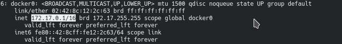
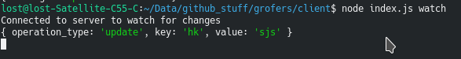
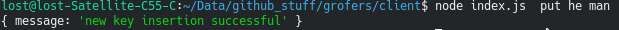
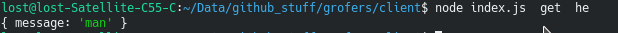

# Key Value Strore Web Service
## List of contents
> List of contents
- **Server**: Server side code( including docker file)
- **Client**: Code for client side cli code
## Setup
> Server
- clone the repo and move to server directory
- sudo docker build -t hk/kv
- sudo docker run -p 8000:8000 -p 3000:3000 -d hk/kv

> Client
- obtain docker ip using "ip addr show"
- change url variable in index.js file in client folder.
# Screenshots
- obtaining docker ip address using "ip addr show"

- push command

- get command

- watch command

